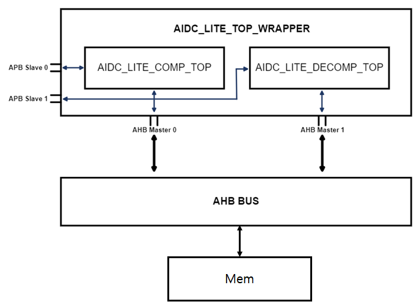

# Integration Guide

# Integration Example

# Port List

| Group     | Port              | Direction | Width     | Description                                |
| :---      | :---              | :---      | :---      | :---                                       |
| Global    | clk               | Input     | 1         | Clock for AHB and APB (up to 200MHz)       |
|           | rst_n             | Input     | 1         | Reset (active low) synchronized to the clk |
| Comp AHB  | comp_hbusreq_o    | Output    | 1         | (Compressor) AHB bus request               |
|           | comp_hgrant_i     | Input     | 1         | (Compressor) AHB bus grant                 |
|           | comp_haddr_o      | Output    | 32        | (Compressor) AHB address                   |
|           | comp_htrans_o     | Output    | 2         | (Compressor) AHB transaction type          |
|           | comp_hwrite_o     | Output    | 1         | (Compressor) AHB write                     |
|           | comp_hsize_o      | Output    | 3         | (Compressor) AHB size (fixed to 32-bit)    |
|           | comp_hburst_o     | Output    | 3         | (Compressor) AHB burst type (fixed to INCR16)|
|           | comp_hprot_o      | Output    | 4         | (Compressor) AHB protection (fixed to 4'b0001, data access)|
|           | comp_hwdata_o     | Output    | 32        | (Compressor) AHB write data                |
|           | comp_hrdata_i     | Input     | 32        | (Compressor) AHB read data                 |
|           | comp_hready_i     | Input     | 1         | (Compressor) AHB ready                     |
|           | comp_hresp_i      | Input     | 2         | (Compressor) AHB response (unused)         |
| Comp APB  | comp_paddr_i      | Input     | 32        | (Compressor) APB address                   |
|           | comp_psel_i       | Input     | 1         | (Compressor) APB selection                 |
|           | comp_penable_i    | Input     | 1         | (Compressor) APB enable                    |
|           | comp_pwrite_i     | Input     | 1         | (Compressor) APB write                     |
|           | comp_pwdata_i     | Input     | 32        | (Compressor) APB write data                |
|           | comp_pready_o     | Output    | 1         | (Compressor) APB ready_out                 |
|           | comp_prdata_o     | Output    | 32        | (Compressor) APB read data                 |
|           | comp_pslverr_o    | Output    | 1         | (Compressor) APB slave error               |
| Decomp AHB| decomp_hbusreq_o  | Output    | 1         | (Decompressor) AHB bus request             |
|           | decomp_hgrant_i   | Input     | 1         | (Decompressor) AHB bus grant               |
|           | decomp_haddr_o    | Output    | 32        | (Decompressor) AHB address                 |
|           | decomp_htrans_o   | Output    | 2         | (Decompressor) AHB transaction type        |
|           | decomp_hwrite_o   | Output    | 1         | (Decompressor) AHB write                   |
|           | decomp_hsize_o    | Output    | 3         | (Decompressor) AHB size (fixed to 32-bit)  |
|           | decomp_hburst_o   | Output    | 3         | (Decompressor) AHB burst type (fixed to INCR16)|
|           | decomp_hprot_o    | Output    | 4         | (Decompressor) AHB protection (fixed to 4'b0001, data access)|
|           | decomp_hwdata_o   | Output    | 32        | (Decompressor) AHB write data              |
|           | decomp_hrdata_i   | Input     | 32        | (Decompressor) AHB read data               |
|           | decomp_hready_i   | Input     | 1         | (Decompressor) AHB ready                   |
|           | decomp_hresp_i    | Input     | 2         | (Decompressor) AHB response (unused)       |
| Decomp APB| decomp_paddr_i    | Input     | 32        | (Decompressor) APB address                 |
|           | decomp_psel_i     | Input     | 1         | (Decompressor) APB selection               |
|           | decomp_penable_i  | Input     | 1         | (Decompressor) APB enable                  |
|           | decomp_pwrite_i   | Input     | 1         | (Decompressor) APB write                   |
|           | decomp_pwdata_i   | Input     | 32        | (Decompressor) APB write data              |
|           | decomp_pready_o   | Output    | 1         | (Decompressor) APB ready_out               |
|           | decomp_prdata_o   | Output    | 32        | (Decompressor) APB read data               |
|           | decomp_pslverr_o  | Output    | 1         | (Decompressor) APB slave error             |

# Internal SRAM List

None

# Integration Test Plan
